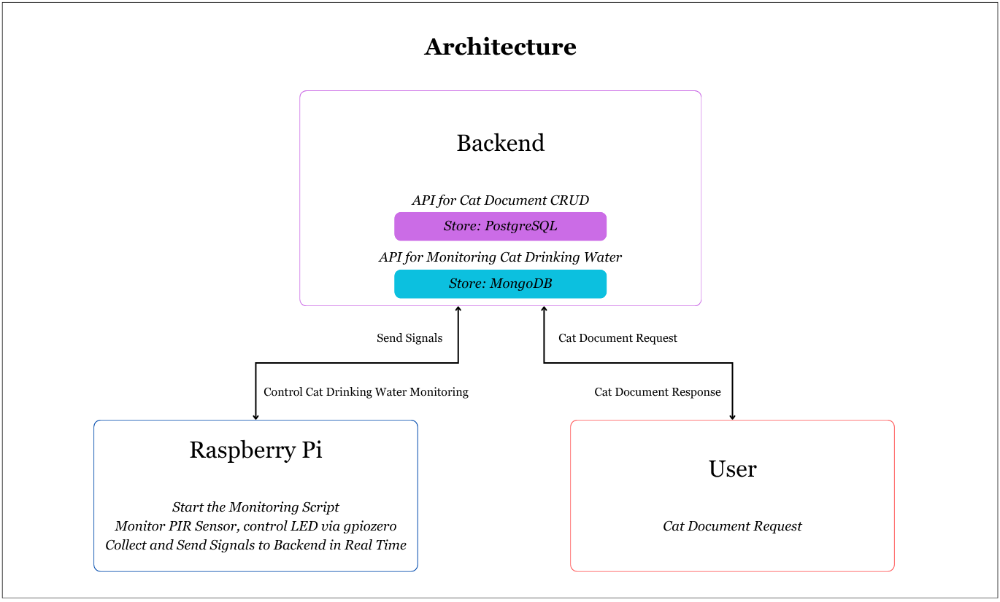
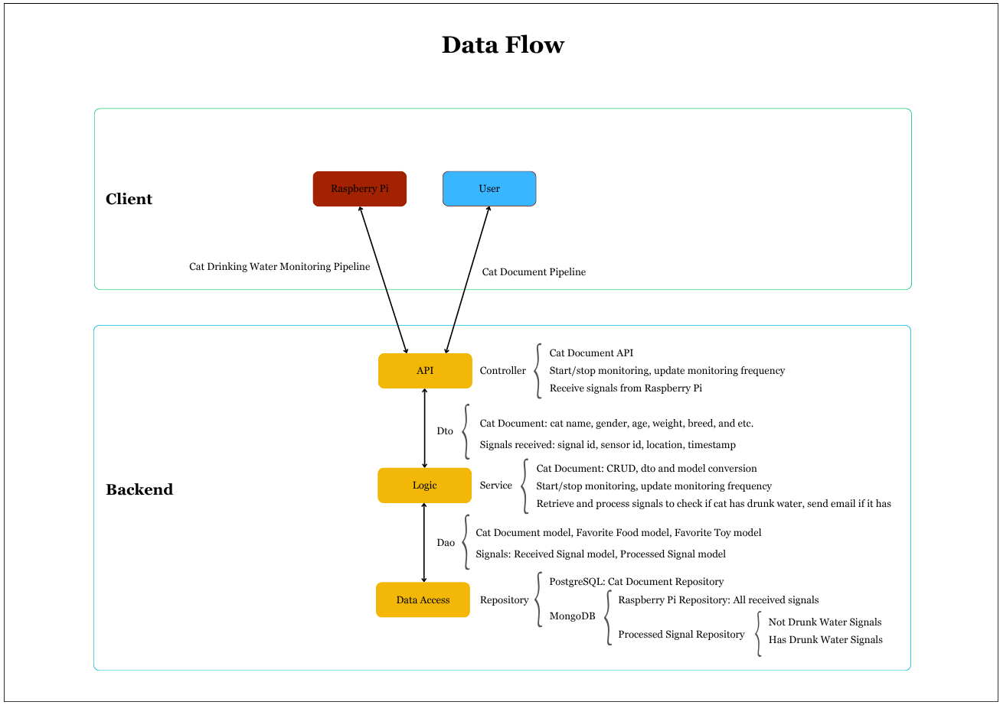
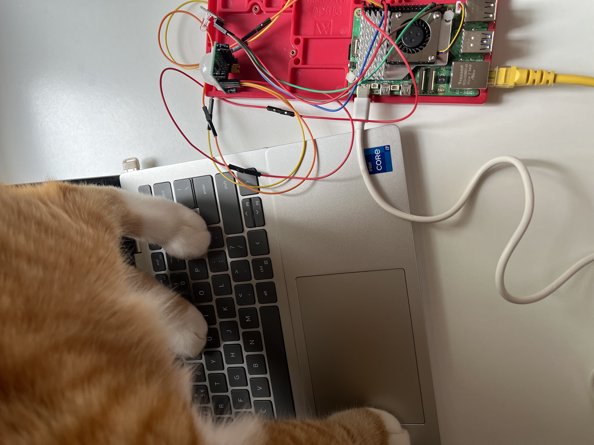

# IoT Cat Tracker Project

## Introduction
This is an IoT project to monitor cats' drinking behavior by collecting data in real-time. Raspberry Pi collects and 
sends data to the server, where the data is processed asynchronously. The monitoring frequency is dynamically configurable, and 
cats' drinking behavior is sent to the user through email, which is either a notification or a summary report.

## Key Features

- Cat hydration behavior can be monitored at varying intervals, which is by minute, 5 minutes, by hour or daily.
- While the system determines the cat has drunk water, it triggers an email.

## Technical Stack and Language
- **Backend**: Spring Boot, PostgreSQL, Spring Data MongoDB, FlaskAPI, Docker, Mailgun, Flyway, GitHub Actions
- **Hardware**: Raspberry Pi, PIR, RGB LED
- **Language**: Java, Python

## Architecture and Data Flow
Architecture:⬇️

Data Flow:⬇️


## Demo
- When cat stands in front of the water bowl or passes by, PIR sensor will detect the motion and light up the red LED,
  meanwhile, signals will be sent to the backend. Once the cat leaves there, the blue LED is on.
  
- If the cat stays 10 seconds or longer and less than 5 minutes, the system will consider the cat is drinking water
  and will send email to the user.
  

## 🐣 Getting Started

### Prerequisites
- JDK 17

### Hardware Setup
- Connect PIR sensor and LED to the GPIO port of Raspberry Pi and connect the network and power cable.

image: Hardware is assembled.
- Open a terminal window on your computer and enter the following command, replacing the <ip address> placeholder with 
the IP address of the Raspberry Pi you're trying to connect to and ‹username> with your username.
```Shell
ssh <username>@<ip address>
```
- Once connected, update your Raspberry Pi OS:
```bash
sudo apt update && sudo apt upgrade -y
```

### Software Setup
- Clone the Repository
```bash
> git clone https://github.com/skogdea/iot-cat-tracker.git
```  
- Use Docker to deploy PostgreSQL and MongoDB
```bash
> docker-compose up -d 
```
- Prepare the environment in Raspberry Pi:
  - Install dependencies and set up environment variables
```bash
> sudo apt-get update 
> sudo apt-get install python3-pip
> python3 -m pip install -r raspberry_pi/requirements.txt
> cp .env.example .env
```
- edit your .env file with your specific information, like IP address and etc
- Create and open the script in the Raspberry Pi:
```Shell
nano pir_flask.py
```
- Copy and paste the code from "raspberry_pi/pir_flask.py" into pir_flask.py on your Raspberry Pi

### Run the System
- Run the backend
- Run the Raspberry Pi script
```Shell
python3 pir_flask.py
```

## Project Contribution
Feel free to submit issues and pull requests to help improve this project.